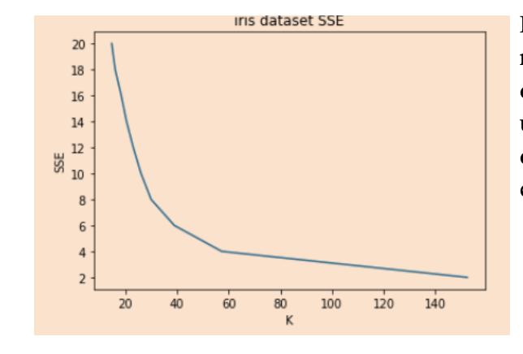
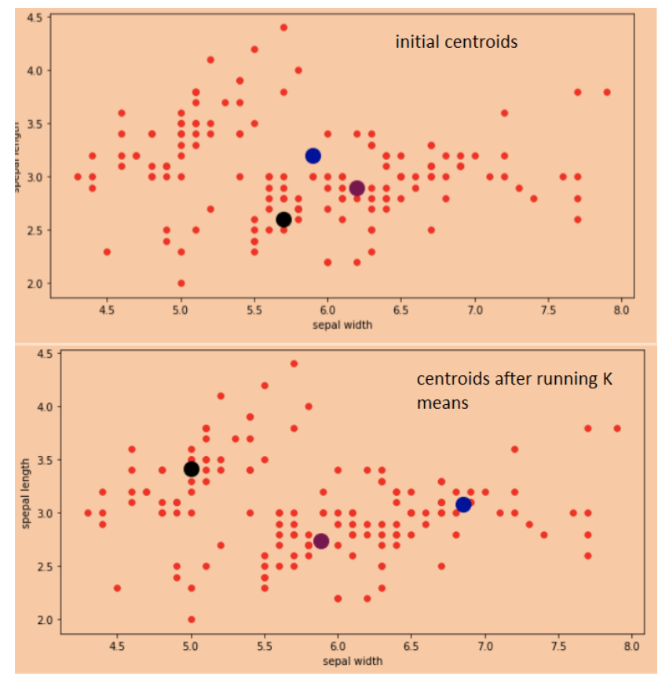
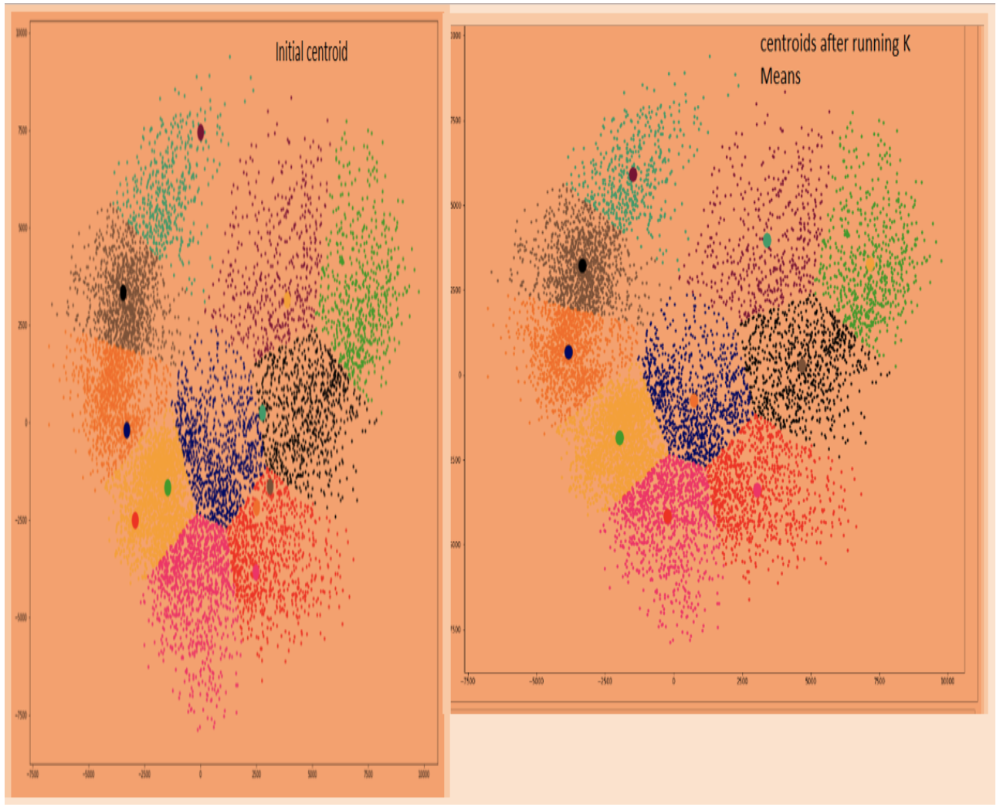

## Handwritten Digit Recognition using K-means Algorithm
In this assignment, we are tasked with to implement our own K means algorithm to be used in a clustering problem. We are provided with two datasets. The first part deals with the famous iris dataset. And, the second part involve clustering hand written digit, where the given dataset contains 10,000 images of handwritten digits between 0 and 9. Each image is represented in a vector of 28 by 28 pixel. The pixels are represented with a number between 0 ad 255, where 0 represent completely white and 255 represent a black pixel. Our task for this project is to use K means clustering in the given dataset.
 K means algorithmic design approach
Before starting, the project requires the student to implement k means clustering algorithm. Since we have two datasets that we have to apply the algorithm, I have tried to be more generic to my approach of writing a function that calculate the k means cluster. I first shuffled the data set in order to select a starting centroid that are representative of the data set. I then picked randomly K centroid from the data set and plotted the point to see whether the points picked are representative of the dataset.
The K means function I wrote, accepts the dataset and centroids value as a parameter. It then iteratively calculates the distance between each data points to the centroids and appends the data point to whichever cluster is closer to the datapoint. To calculate distance, I have used the Euclidean distance.
Once I have all the data point assigned to its closest centroid, I find the new centroid by taking the avergae of all the points designated to each centroid. Once I have the new centroid computed, I compare the changes in the centroids with the current centroid and the whole process repeats until the centroids converges to some value.
### Part-1 iris data set

 First, I started with the iris dataset. Since the K value is not provided, I wanted to find out what will be the optimal K value I can use to cluster the dataset. I have used the elbow method which uses the SSE( the sum of  squared distance of samples to their closest cluster center) to determine the value of K.As shown in the figure on top,I have plotted  the SSE of different K value. It is apparent the plot starts to flatten when K’s value is 3.

Hence, I have used K=3 to run the K means algorithm on the iris data set. After running K means, I am able to observe how the centroids moved from their original position. As shown in the figure above, I have plotted the data points against the initial centroid and the final centroid generated by the  K means algorithm. As the figure above labeled “centroids after running K means” shows, it is observable that the centroid have moved towards the center of the clusters from their original point. Hence, the algorithm is able to move the centroid to the optimal position. The hardest part in this part was finding initial centroid that are representative of the data points in the dataset. Since, I am picking points randomly from the dataset to be used as initial centroids, my strategy was to plot the point and the initial centroid and pick the points that are somewhat far apart from each other. Using this approach, I am able to get 72% accuracy for the iris dataset. 

### Part 2 - Image clustering

- ##### Running with full Dimensions:
For the second part, we are tasked to build a cluster that classifies hand written digits. In order to test my algorithm, I tested the K means algorithm on the dataset without doing any preprocessing such as removing image noise or compressing redundant information. Since the data were mostly sparse data, I was able to get only 46% percent accuracy using the original vectors.

- ##### After applying preprocessing and dimensional reduction
As mentioned earlier the algorithm was not doing very well without preprocessing, hence,  I turned my attention into reducing the dimensions of the data to ensure that the clustering algorithm has reasonable features to work with. I was able reduce the dimensional to 6 using the manifold isometric mapping which is an extension of kernel PCA dimensional reduction algorithm. The reason I chose manifold not PCA is manifold handles well non linear structure in data. 

the result of applying dimensional reduction had a promising result. As shown in the figure above, after applying K means to the data, the centroids moved around toward the middle of each cluster the only problem I experienced in this part is picking initial centroids. It took me a few trial and error to pick the optimal initial centroid. The figure below took 61 runs for the centroid to converge to the final position of the centroids shown to right of the figure above.
